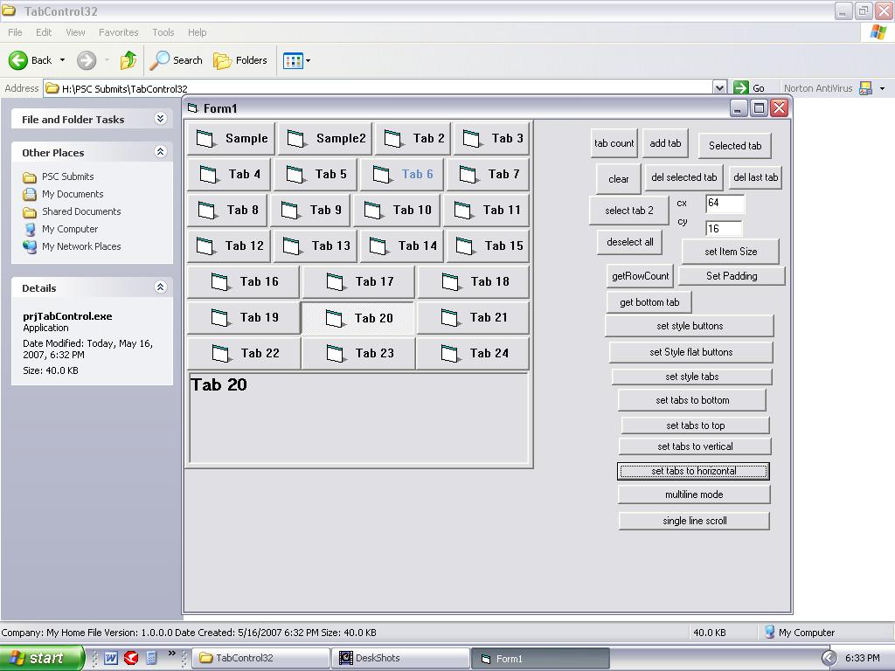



## TabControl32\(Updated\)

### Description

TabControl32 in VB with Icons on tabs

**Features**

NO OCXs,DLLs ,Pure API

Different Styles

Best Performance

Easy to use

Best Speed

----

Now included comments per line so you can easily understand.

I didn't included subclassing because I found another easy way to receive the events.

Please..........Vote my program..........
 
### More Info
 

             |
---                |---
**Submitted On**   |2007-05-16 00:31:50
**By**             |[Joshy Francis](https://github.com/Planet-Source-Code/PSCIndex/blob/master/ByAuthor/joshy-francis.md)
**Level**          |Advanced
**User Rating**    |4.8 (24 globes from 5 users)
**Compatibility**  |VB 6\.0
**Category**       |[Windows API Call/ Explanation](https://github.com/Planet-Source-Code/PSCIndex/blob/master/ByCategory/windows-api-call-explanation__1-39.md)
**World**          |[Visual Basic](https://github.com/Planet-Source-Code/PSCIndex/blob/master/ByWorld/visual-basic.md)
**Archive File**   |[TabControl2066305182007\.zip](https://github.com/Planet-Source-Code/joshy-francis-tabcontrol32-updated__1-68619/archive/master.zip)

